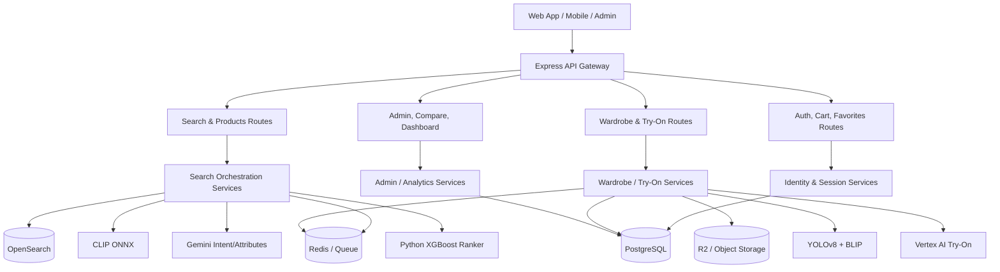
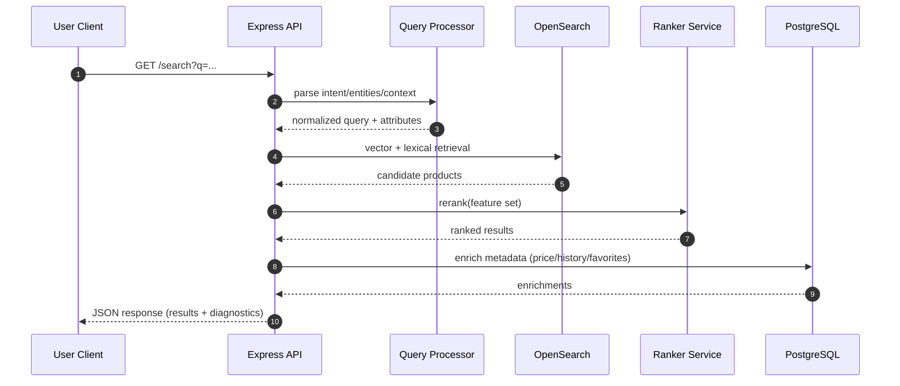
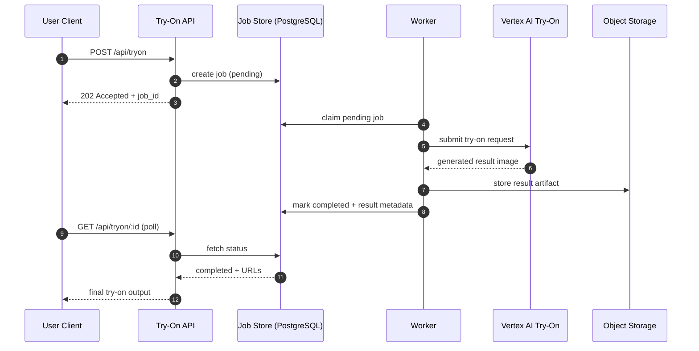
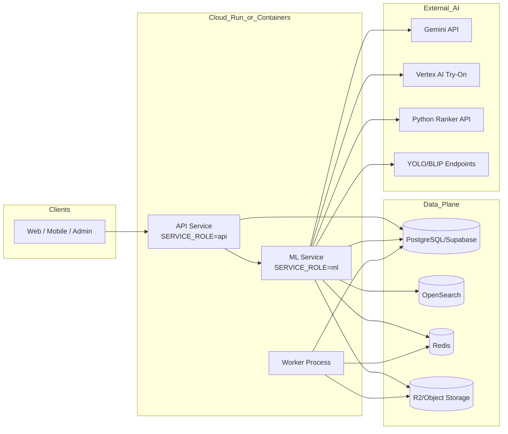
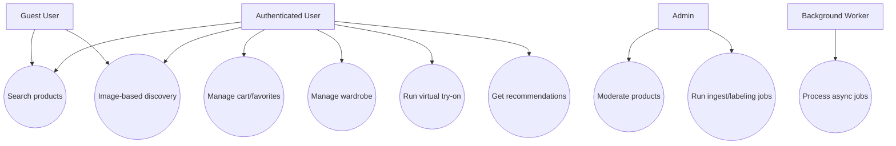

# System Architecture, UML, and Use Cases

This document provides a lead-engineer view of the `marketplace` system:
- high-level architecture
- UML diagrams (component, sequence, deployment, use case)
- key business and technical use cases

---

## 1) Architecture Overview

`marketplace` is an AI-enabled fashion commerce platform built as a TypeScript/Node.js backend with modular Express routes and shared domain libraries.

Core capabilities:
- multi-vendor product aggregation
- semantic text and image search
- recommendation and compare intelligence
- wardrobe analysis and outfit assistance
- async virtual try-on processing

Design characteristics:
- **Modular monolith by default** (`SERVICE_ROLE=all`)
- **Split deployment support** (`SERVICE_ROLE=api` and `SERVICE_ROLE=ml`)
- **Hybrid retrieval architecture** (vector + lexical + rule/model reranking)
- **Operational safety** (health/metrics, background workers, graceful degradation when optional ML models are unavailable)

---

## 2) Layered System Architecture

### 2.1 Logical Layers

1. **Client Layer**
   - Web and admin clients call REST endpoints.
2. **API Layer (Express Routes + Controllers)**
   - Auth, Cart, Favorites, Compare, Try-On, Search, Products, Wardrobe, Admin, Health, Metrics.
3. **Domain Service Layer**
   - Search, ranking, compare, wardrobe, image processing, queue/workflow logic.
4. **Data & Infra Layer**
   - PostgreSQL (Supabase), OpenSearch, Redis, object storage (R2/Supabase Storage).
5. **AI/ML Layer**
   - ONNX CLIP, YOLOv8 client, BLIP client, Gemini APIs, Vertex AI Try-On, Python ranker service.

### 2.2 Component Diagram (UML)

---

## 3) Runtime View

### 3.1 Main Request Flow

### 3.2 Async Virtual Try-On Flow

---

## 4) Deployment Architecture

### 4.1 Typical Production Topologies

1. **Unified mode** (`SERVICE_ROLE=all`)
   - Single service runs API + ML-capable routes.
2. **Split mode**
   - `marketplace-api` for auth/commerce/admin routes.
   - `marketplace-ml` for search/wardrobe/ingest/ML-heavy routes.
   - API service proxies ML requests to `ML_SERVICE_URL`.

### 4.2 Deployment Diagram (UML)

---

## 5) Use Case Model

### 5.1 Primary Actors

- **Guest User**: browses/searches products.
- **Authenticated User**: uses personalized features (favorites, cart, wardrobe, try-on history).
- **Admin/Moderator**: curates catalog and runs moderation/ops tasks.
- **Background Worker**: executes queued or scheduled workloads.
- **External AI Services**: provide inference and generation capabilities.

### 5.2 Use Case Diagram (UML)

---

## 6) Detailed Use Cases

### UC-01: Semantic Product Search
- **Actor**: Guest or Authenticated User
- **Preconditions**: Search index is available.
- **Trigger**: User submits text query.
- **Main Flow**:
  1. API validates and normalizes query.
  2. Query processor extracts intent/entities and optional constraints.
  3. Search service executes hybrid retrieval (vector + lexical).
  4. Ranking stage orders and deduplicates results.
  5. Response returns ranked products and diagnostics.
- **Postconditions**: Search interaction logged for analytics/tuning.

### UC-02: Multi-Image + Prompt Search
- **Actor**: Guest or Authenticated User
- **Preconditions**: User uploads up to 5 images.
- **Trigger**: User requests composite search.
- **Main Flow**:
  1. Images and prompt are sent to composite search endpoint.
  2. Gemini-based parsing builds attribute intent.
  3. Per-attribute embeddings are generated.
  4. Weighted retrieval + reranking produces final list.
- **Alternate Flow**: If one signal fails, remaining signals continue with fallback weights.

### UC-03: Virtual Try-On Job Lifecycle
- **Actor**: Authenticated User
- **Preconditions**: User identity present, rate limit not exceeded.
- **Trigger**: User submits try-on request.
- **Main Flow**:
  1. API creates job and returns `202 Accepted`.
  2. Worker processes job asynchronously.
  3. Vertex AI generates try-on output.
  4. Result is stored and job transitions to completed.
  5. Client polls status endpoint and retrieves result.
- **Failure Flow**: Job transitions to failed with reason; user can retry.

### UC-04: Wardrobe Intelligence
- **Actor**: Authenticated User
- **Preconditions**: User has wardrobe items or uploads new photos.
- **Trigger**: User requests analysis/suggestions.
- **Main Flow**:
  1. Wardrobe image analysis classifies items (YOLO/Gemini).
  2. User items are indexed/updated.
  3. Compatibility and style profile logic generates suggestions.
  4. API returns outfit ideas and confidence/coherence scores.

### UC-05: Admin Moderation and Operations
- **Actor**: Admin/Moderator
- **Preconditions**: Admin auth and role checks pass.
- **Trigger**: Admin flags/hides products or runs operational jobs.
- **Main Flow**:
  1. Admin route validates permissions.
  2. Service updates product moderation state or queue/task execution.
  3. Dashboard and analytics endpoints expose operational status.

---

## 7) Architecture Decisions and Rationale

- **Hybrid search over pure vector search**: improves precision for intent-rich commerce queries.
- **Async try-on pattern**: avoids client timeouts for heavy generation workloads.
- **Role-based split deployment**: allows independent scaling of API-heavy and ML-heavy workloads.
- **Modular route/service boundaries**: keeps business logic testable and reusable.
- **Graceful model fallback**: preserves baseline service continuity when optional ML dependencies are degraded.

---

## 8) Non-Functional Architecture Targets

- **Performance**: low-latency retrieval through OpenSearch k-NN + caching and index warmup.
- **Scalability**: horizontal scale via split API/ML services and worker offloading.
- **Reliability**: health probes, retries, queue-based decoupling, clear job states.
- **Security**: JWT auth, role middleware, rate limiting, secure secret handling.
- **Observability**: structured logs, Prometheus metrics, readiness/liveness endpoints.

---

## 9) Suggested Next Extensions

- Add C4 model views (Context, Container, Component) as a companion doc.
- Add threat model (STRIDE) for auth, upload, and AI integration surfaces.
- Add sequence diagrams for cart/checkout and admin labeling flows.
- Add SLO/SLA appendix for search and try-on latency budgets.

