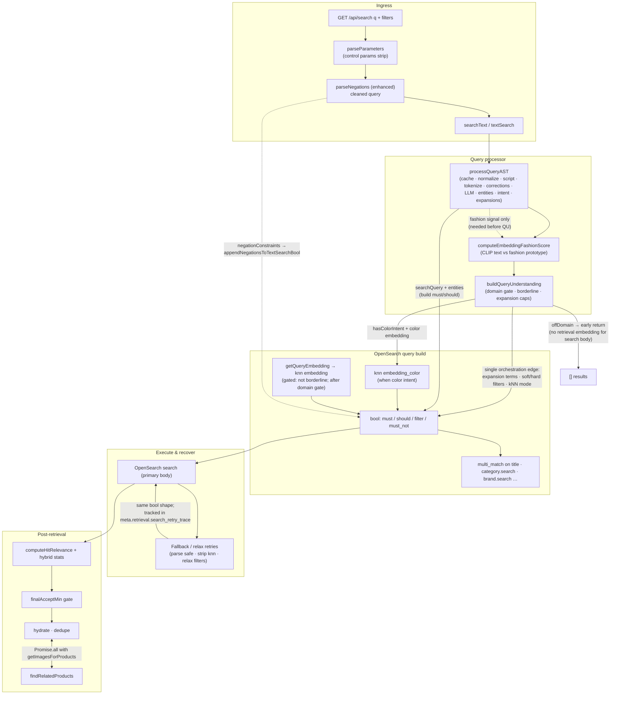

# Text search architecture

This document is the canonical flow for **enhanced** product text search (`textSearch` in `src/routes/search/search.service.ts`, exposed via `searchText` in `src/lib/search/fashionSearchFacade.ts` and `GET /api/search`).

## End-to-end flow (Mermaid)

### Diagram notes (bug list alignment)

| Topic | How it is represented |
|--------|------------------------|
| **Single QU → bool edge** | One labeled edge from `buildQueryUnderstanding` to the bool builder. AST feeds lexical/entity structure separately; retrieval embedding is not drawn as AST → TXTEMB. |
| **Domain gate vs CLIP** | `computeEmbeddingFashionScore` runs before `buildQueryUnderstanding` because the score **is an input** to the domain blend (`queryUnderstanding.service.ts`). `getQueryEmbedding` for **search** runs only after `qu.offDomain` is false and `!qu.borderlineFashion`. |
| **COLOR knn** | Trigger is `hasColorIntent` (caller/AST colors) → `attributeEmbeddings.generateTextAttributeEmbedding` → `should` knn on `embedding_color`. |
| **EF → QU** | Fashion embedding score is consumed inside `buildQueryUnderstanding` (not a dead end in code). |
| **Fallback → bool** | Retries rebuild `bool` (must/should/filter); steps are recorded in `meta.retrieval.search_retry_trace` (and eval `flags.search_retry_trace`). |
| **Negations** | Enhanced route passes `negationConstraints` into `textSearch`; clauses are appended as `must_not` on index fields (`appendNegationsToTextSearchBool`). |
| **Related failures** | `findRelatedProducts` errors surface as `meta.related_fetch_error` when the fetch rejects. |
| **recallWindow vs finalAcceptMin** | `recall_size` fetches a window; `final_accept_min` filters after `computeHitRelevance`. When OpenSearch returns hits but the gate removes all, see `meta.retrieval` (`below_relevance_threshold`, counts). |

## Key files

| Stage | File |
|--------|------|
| Ingress / negation parse | `src/routes/search/search.controller.ts`, `src/lib/queryProcessor/parameterParser.ts`, `src/lib/queryProcessor/negationHandler.ts` |
| AST pipeline | `src/lib/queryProcessor/index.ts` |
| Query understanding | `src/lib/search/queryUnderstanding.service.ts` |
| Fashion embedding signal | `src/lib/search/fashionDomainSignal.ts` |
| OpenSearch body + retries | `src/routes/search/search.service.ts` (`textSearch`) |
| Relevance / gate | `src/lib/search/searchHitRelevance.ts`, `config.search.finalAcceptMin` |
| Related | `src/lib/search/relatedProducts.ts` |
| Config | `src/config.ts` (`recallWindow`, `finalAcceptMin`, …) |

## Improvement backlog (from product review)

- **A – Query cache before heavy AST** – L1: `getCachedQueryAST(raw, { useLLM, useMLIntent })`. L2: opt-in `SEARCH_QUERY_AST_REDIS=1` + Upstash (`queryAstRedisCache.ts`), TTL `SEARCH_QUERY_AST_REDIS_TTL_SEC`, locale segment `SEARCH_QUERY_AST_LOCALE`.
- **B – Proactive knn-in-must demotion** – `SEARCH_KNN_DEMOTE_LOW_FASHION_EMB=1` and score below `SEARCH_KNN_DEMOTE_FASHION_EMB_MAX` forces kNN should-boost before OpenSearch when `SEARCH_KNN_TEXT_IN_MUST=1`.
- **C – Observability** – `SEARCH_DEBUG=1` adds `meta.debug.pipeline_stages` (wall-clock markers). Extend as needed for spans export.
- **F – Gender filter** – `SEARCH_GENDER_UNISEX_OR` (default on) adds indexed `unisex` to strict/soft gender clauses for binary men/women-style queries.

## Environment variables (partial)

See `.env.example` for full list. Text search often uses: `SEARCH_DEBUG`, `SEARCH_RECALL_WINDOW`, `SEARCH_FINAL_ACCEPT_MIN_TEXT` (or legacy `SEARCH_FINAL_ACCEPT_MIN`), `SEARCH_EVAL_LOG`, `SEARCH_KNN_TEXT_IN_MUST`, domain gate flags in `queryUnderstanding.service.ts`. Image search uses `SEARCH_FINAL_ACCEPT_MIN_IMAGE` separately.
