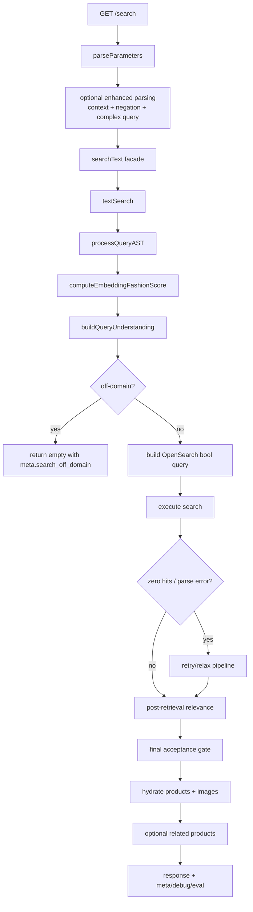

# Text Search Architecture and Pipeline

Companion doc: `docs/embeddings-and-search-pipelines.md` explains index-time embedding generation and image search. This file focuses on query-time text search for `GET /search`.

Canonical runtime path:

- HTTP route: `src/routes/search/search.controller.ts`
- Facade adapter: `src/lib/search/fashionSearchFacade.ts`
- Core engine: `src/routes/search/search.service.ts` (`textSearch`)
- Query AST pipeline: `src/lib/queryProcessor/index.ts`
- Query understanding policy: `src/lib/search/queryUnderstanding.service.ts`

## 1) What This Pipeline Does

`GET /search` is not only keyword matching. It combines:

- Query parsing and cleanup (including control-parameter stripping from free text).
- Query understanding (domain confidence, expansion policy, strict vs soft intent application).
- Hybrid retrieval in OpenSearch:
  - lexical BM25-style clauses
  - optional CLIP text-to-image kNN boost/constraint
  - optional color embedding kNN boost
- Constraint-aware retries when strict filters return zero hits.
- Post-retrieval relevance scoring and final acceptance gating.

The pipeline is optimized to avoid two failure modes:

- Overly strict retrieval returning zero results for valid intent.
- Overly loose retrieval returning semantically unrelated products.

## 2) End-to-End Request Flow

## 3) HTTP Layer Details (`GET /search`)

At ingress (`search.controller.ts`):

1. Reads request params (`q`, filters, `limit`, `offset`, `session_id`, `enhanced`).
2. Calls `parseParameters(rawQuery)` to strip control tokens embedded inside text, for example:

- `"red dress limit=50"`
- `"blue blazer page 2"`

3. Optionally runs enhanced pre-processing:

- conversational context enrichment
- negation extraction (`without stripes`, `not formal`)
- complex-query parsing

4. Merges route-level filters and passes them to facade `searchText(...)`.
5. Sends `negationConstraints` to core `textSearch` so they become `bool.must_not` clauses.

Important:

- Text search route is mounted at `/search`, not `/api/search`.
- Caller query params override control params extracted from free text.

## 4) QueryAST Pipeline Internals

`textSearch` calls `processQueryAST(rawQuery)` (implemented in `src/lib/queryProcessor/index.ts`).

Stages:

1. Parameter extraction (again, canonical pipeline-level extraction).
2. Cache lookup:

- in-memory cache
- optional Redis cache (`SEARCH_QUERY_AST_REDIS=1`)

3. Normalization:

- lowercase and space cleanup
- preserve protected spans (numbers, sizes, percentages)

4. Script detection (en/ar/arabizi/mixed).
5. Tokenization.
6. Corrections:

- spell correction
- arabizi mappings
- dictionary-based corrections

7. Optional LLM rewrite (gated).
8. Entity and filter extraction.
9. Intent classification (rules + optional ML fallback).
10. Expansion generation (synonyms, category expansions, transliterations).
11. Build and return `QueryAST` with confidence and corrected `searchQuery`.

Output used by retrieval:

- `ast.searchQuery` (canonical query text)
- `ast.entities.*` (category, brand, color, productTypes, gender, age)
- `ast.expansions.*`
- `ast.confidence`

## 5) Query Understanding Policy Layer

`buildQueryUnderstanding(ast, rawQuery, { callerPinnedColor, embeddingFashion01 })` determines how aggressive retrieval should be.

Core decisions:

- `offDomain`: hard-stop (return empty) when domain gate is enabled.
- `borderlineFashion`: keep retrieval lexical-heavy and safer.
- `dropCategoryExpansions` / `dropSynonymExpansions`: expansion pruning for low confidence.
- `softColorFromAst`: AST-only low-confidence color becomes boost, not hard filter.
- `knnTextBoostOnly`: default kNN behavior unless explicitly configured otherwise.

Domain confidence is blended from:

- AST anchor signals (types/categories/brands/materials/patterns)
- intent and AST confidence
- optional CLIP-based fashion-domain score (`computeEmbeddingFashionScore`)

If `SEARCH_DOMAIN_GATE=true` and query is off-domain, response returns no hits with `meta.search_off_domain=true`.

## 6) OpenSearch Query Construction

The engine builds one `bool` query with:

- `must`: lexical relevance constraints.
- `should`: ranking boosts (expansions, soft entities, vector boosts).
- `filter`: hard constraints (visibility, caller filters, strict AST decisions).
- `must_not`: negation constraints from enhanced parsing.

### 6.1 Mandatory lexical retrieval

Primary clause uses `multi_match` over:

- `title` (highest boost)
- `title.raw`
- `category.search`
- `brand.search`
- `description`

Also includes phrase boosting and optional length-intent must-clauses (for terms such as midi/maxi).

### 6.2 Expansions

Filtered expansion terms from query-understanding are added as lower-weight `should` clauses for recall.

### 6.3 Product type strategy

- Default: soft boosting using taxonomy-expanded terms.
- Optional strict mode (`SEARCH_STRICT_PRODUCT_TYPE=true`): hard product-type filter.

### 6.4 Color strategy

- Caller-pinned color generally becomes hard filter.
- AST low-confidence color may become soft boost (`softColorFromAst`).
- For single-color hard filters, engine first filters by primary color (`attr_color`) for precision.

### 6.5 Audience and category strategy

- Category can be hard or soft depending on confidence and query composition.
- Gender/age can be hard filters or soft boosts depending on caller pinning and AST confidence.
- Unisex can be included in audience matching when `SEARCH_GENDER_UNISEX_OR=1`.

### 6.6 Optional vector boosts

1. Color semantic boost:

- if color intent exists, generate color text embedding
- add `knn` on `embedding_color` in `should`

2. Text hybrid kNN:

- get CLIP text embedding from `ast.searchQuery`
- default mode: `should` boost only
- optional legacy mode: `must` + `min_score` when `SEARCH_KNN_TEXT_IN_MUST=1`
- skipped for borderline-fashion mode

## 7) Execution, Retry, and Relaxation Pipeline

After primary OpenSearch execution, multiple resilience steps may run.

### 7.1 Parse-safe fallback

If OpenSearch rejects advanced clauses (parsing/fuzziness issues), pipeline retries with a safer simplified bool query and no risky structures.

Trace marker: `parse_error_safe_bool`

### 7.2 Zero-hit kNN fallback

If embedding was used and total hits are zero, retry BM25 without kNN constraints.

Trace marker: `zero_hit_bm25_without_knn`

### 7.3 Strict-filter relaxation

On zero hits, engine progressively relaxes constraints:

1. Widen hard AST category resolution.

- `zero_hit_category_filter_widened`

2. If single primary color was strict, retry with `attr_colors`.

- `zero_hit_primary_color_to_attr_colors`

3. Drop strict color filters.

- `zero_hit_drop_strict_colors`

4. Drop strict product type filters.

- `zero_hit_drop_product_types`

5. Drop strict audience filters (gender/age).

- `zero_hit_drop_audience_filters`

All steps are recorded in `meta.retrieval.search_retry_trace`.

## 8) Post-Retrieval Relevance and Final Gate

Raw OpenSearch score is not the final ranking metric.

For each hit, `computeHitRelevance(...)` combines:

- type compatibility
- category alignment
- color compliance
- audience compliance
- lexical and semantic signals
- cross-family penalties

Then the pipeline:

1. Sorts by `finalRelevance01`, then deterministic tie-breakers.
2. Applies final acceptance threshold `finalAcceptMin` (from config).
3. Optionally applies strict color postfilter for explicit color queries.
4. Hydrates accepted IDs from database and attaches images.
5. Deduplicates final results.

If OpenSearch had hits but final gate removes all, `meta.below_relevance_threshold` is set.

## 9) Response Shape and Telemetry

Main response fields:

- `results`
- `related` (optional)
- `total`
- `tookMs`
- `did_relax` (boolean: true when any retry/relax fallback path was used)
- `query` (AST summary)
- `meta`

Important `meta` keys:

- `processed_query`: full AST snapshot
- `did_you_mean`
- `below_relevance_threshold`
- `recall_size`
- `final_accept_min`
- `retrieval.search_retry_trace`
- `retrieval.did_relax`
- `debug.pipeline_stages` (when debug enabled)
- `related_fetch_error` (if related-products fetch fails)

Optional evaluation logs:

- enabled by `SEARCH_EVAL_LOG`
- include flags such as `off_domain_blocked`, `knn_boost_only`, `search_retry_trace`, and final relevance scores

## 10) Key Environment Flags for Text Search

The authoritative list is `.env.example`. High-impact text flags are:

Core behavior:

- `SEARCH_DOMAIN_GATE` (default enabled; disable explicitly with `0/false` only if you want legacy behavior)
- `SEARCH_RECALL_WINDOW`
- `SEARCH_RECALL_MAX`
- `SEARCH_FINAL_ACCEPT_MIN_TEXT` (or legacy `SEARCH_FINAL_ACCEPT_MIN`)
- `SEARCH_RELEVANCE_GATE_MODE`

Hybrid vector behavior:

- `SEARCH_KNN_TEXT_IN_MUST`
- `SEARCH_KNN_DEMOTE_LOW_FASHION_EMB`
- `SEARCH_KNN_DEMOTE_FASHION_EMB_MAX`
- `CLIP_SIMILARITY_THRESHOLD`

Expansion and confidence policy:

- `SEARCH_EXPANSION_MAX_TERMS`
- `SEARCH_EXPANSION_MAX_SYNONYMS`
- `SEARCH_EXPANSION_MAX_CATEGORY`
- `SEARCH_EXPANSION_MAX_TRANSLIT`
- `SEARCH_AST_EXPANSION_CONFIDENCE_MIN`
- `SEARCH_AST_SOFT_COLOR_CONFIDENCE`

Filter strictness:

- `SEARCH_STRICT_CATEGORY_DEFAULT`
- `SEARCH_STRICT_PRODUCT_TYPE`
- `SEARCH_FILTER_HARD_MIN_CONFIDENCE`
- `SEARCH_GENDER_HARD_MIN_CONFIDENCE`
- `SEARCH_GENDER_UNISEX_OR`
- `SEARCH_COLOR_POSTFILTER_STRICT`

Observability and analysis:

- `SEARCH_DEBUG`
- `SEARCH_TRACE_BREAKDOWN`
- `SEARCH_RANKING_DEBUG`
- `SEARCH_EVAL_LOG`
- `SEARCH_EVAL_VARIANT`

Caching:

- `SEARCH_QUERY_AST_REDIS`
- `SEARCH_QUERY_AST_REDIS_TTL_SEC`
- `SEARCH_QUERY_AST_LOCALE`

## 11) Troubleshooting Playbook

### Symptom: good query returns zero results

Check in order:

1. `meta.search_off_domain` and `meta.query_understanding`.
2. `meta.retrieval.search_retry_trace` to confirm relax stages.
3. `meta.below_relevance_threshold` and `final_accept_min`.
4. strict color/type/audience filters in debug metadata.

### Symptom: too many irrelevant results

Check:

1. Whether query fell into BM25-only fallback too early.
2. Whether soft gates are enabled (`SEARCH_RELEVANCE_GATE_MODE=soft`).
3. Expansion caps and low-confidence expansion behavior.

### Symptom: color queries are unstable

Check:

1. Caller-pinned color vs AST-extracted color path.
2. `SEARCH_COLOR_POSTFILTER_STRICT` behavior.
3. Whether color moved from primary-color strict to `attr_colors` fallback.

## 12) Source Map

- Route and enhanced request parsing: `src/routes/search/search.controller.ts`
- Parameter stripping from free text: `src/lib/queryProcessor/parameterParser.ts`
- Query AST pipeline and CLIP text embedding: `src/lib/queryProcessor/index.ts`
- Domain and policy heuristics: `src/lib/search/queryUnderstanding.service.ts`
- Main retrieval, retries, ranking, response meta: `src/routes/search/search.service.ts`
- Facade normalization and response shaping: `src/lib/search/fashionSearchFacade.ts`
- Hit-level relevance scoring: `src/lib/search/searchHitRelevance.ts`

---

If you change ranking or strictness behavior in code, update this file and `.env.example` together so operators and integrators keep a correct mental model of the active pipeline.
